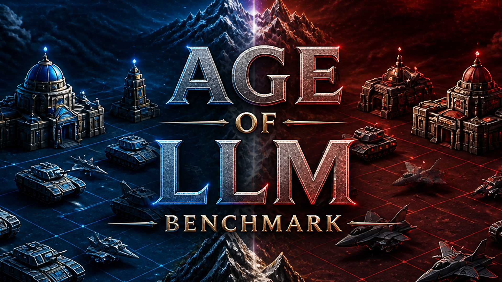

# Age of LLM™ — Benchmark · v0.16.0



> Project name: **Age of LLM™ — Benchmark** (formerly "Modern War").

A strategic **1v1 benchmark between two LLMs**. Two language models face off in a
turn-based duel: the goal is to **destroy the enemy base**, either by **nuclear
bomb** or by **military conquest** (tanks). The game measures reasoning under
uncertainty (fog of war), diplomacy (bluff, deterrence, betrayal) and strategic
timing. **No strategic advice is given to the models** — they must deduce
everything on their own.

The **ranking is point-based** (win = 3, draw = 1, loss or mutual destruction =
0) and also aggregates average thinking time, average tokens per turn and the
illegal-action rate.

This repository is the **V2**: rules heavily simplified compared to V1 (an old
Ursina/3D game) and an **isometric web viewer** in Canvas 2D instead of 3D
rendering.

> Three pillars kept: **fog of war + memory**, **full diplomacy**, **nuclear
> deterrence**.
> Three layers removed vs V1: **steel/trucks**, **unit HP**,
> **factories/research centers**.

---

## What's new in v0.16.0

This release makes the system prompt **fully rule-only**. Engine bumped **0.15.0 → 0.16.0**.

- **Removed the last two tactical seed phrases from the system prompt.** Earlier
  versions still contained two residual hints — *"Push tanks + a scout into enemy
  ground to contest their economy"* and *"Scout with a drone early"* — described as
  the *"two tactical seed phrases present during data collection"* in the companion
  paper (Section 2.7). They are now removed, so the prompt describes **only the
  rules, win conditions and the JSON schema, with no strategic or build-order
  advice**. Replays produced from v0.16.0 onward are a clean, advice-free baseline;
  the v0.9.2–v0.15.0 corpus (the 54 matches analysed in the papers) is unaffected
  and remains as collected, with the seed phrases present.

## What's new in v0.15.0

This release adds a **nuclear early-warning signal**. Engine bumped
**0.14.0 → 0.15.0**.

- **Nuclear early-warning (detected enemy launch).** When the opponent launches a
  bomb, the player is now informed — but **only if the player can currently see
  an enemy silo** in their field of view. Fog of war is respected: a launch from
  a hidden silo stays secret. This gives a player with a visible enemy silo a
  one-turn window to **retaliate** (launch their own bomb the same turn → mutual
  destruction instead of a clean nuclear defeat).

## What's new in v0.14.0

- **Fog of war — enemy-side deposits are now remembered.** A resource deposit
  (gisement) scouted on the enemy side is exposed to the model and **kept in
  memory after discovery** (`remembered_enemy_deposits`: `kind`, `pos`,
  `reserve`, `last_seen_tour`, `currently_visible`) — just like remembered enemy
  buildings. Previously enemy-side deposits were filtered by territory and never
  revealed, even when a unit had eyes on them. Building a mine there still
  requires the cell to be in your **current** field of view (the enemy may have
  built on it since), and an exhausted deposit is dropped from memory.

## What's new in v0.13.0

This release adds **ChampionAgent**, a strong **fully deterministic** scripted
opponent meant to serve as a **fixed reference opponent**: in a "LLM vs Champion"
match all the variance comes from the LLM alone, which makes the result far more
reliable than two non-deterministic models facing each other. Engine and
schema bumped **0.12.0 → 0.13.0**.

**ChampionAgent strategy (`engine/agents.py`)**

- **Efficient nuclear rush** — builds uranium economy + an early silo + a scout
  drone, and **launches the instant** silo/fuel/enemy-base-discovered are all
  satisfied.
- **Fights for the central mine instead of camping** — pushes Tanks to destroy
  the enemy central mine (denying its fuel) and reclaim the deposit, and defends
  its own. This turns the match into a real military contest over the middle of
  the map rather than a passive economic race.
- **Air defense (SAM)** — when the opponent fields Fighters/Drones (a Tank cannot
  hit a Fighter; the SAM is the only counter), it builds and maneuvers SAMs to
  escort the Tank push and cover the center and its scout drone.
- **Unified attack priority**: (1) **finish** the enemy base if a Tank hit ends
  the game, (2) **defense** — destroy an enemy Tank threatening our base/silo,
  (3) kill the most valuable in-range unit (tactical triangle, SAM included),
  (4) deny center / chip buildings: central mine > silo > base > economy.
- **Rational diplomacy with bluffing** (uranium is secret): genuine ultimatum
  when crushing; ceasefire/ultimatum **bluff** when slightly behind; sues for
  **peace** when losing badly; always refuses ultimatums; one proposal per kind.
- **Deterministic contextual key phrases** on the message channel each turn.

**Engine / runner**

- **Prompt clarification (`engine/prompts.py`)** — documents the **action
  resolution order**: the (up to 3) actions resolve **one by one in the order
  listed**, each on the board left by the previous one. A `move` can revoke the
  vision a later `build` needs (→ "not in your field of view"), and a unit cannot
  end its `move` on a cell where a building is queued the same turn. This is a
  pure rules clarification — still **no strategic advice**.
- **`run_game.py`** — `champion` is now selectable as `--p0`/`--p1` alongside
  `greedy`/`random`.
- **`run_queue.py`** — scripted (non-LLM) agents are selectable from `queue.json`
  via `"provider": "scripted"` and `"model": "champion"` (or `greedy`/`random`),
  with an optional fixed per-slot `"seed"`. They are drop-in replacements for an
  `LLMAgent`.

**Validation.** 400+ Champion-vs-Champion matches terminate cleanly (~0.2 benign
rejected actions/game), determinism verified (identical replay hash on equal
seed), the Champion dominates Greedy/Random and survives a dedicated air-rush
exploit bot (>90%). The residual slot skew in the deterministic mirror is an
artifact of two identical strategies and is neutralized by **side-swapping**
(play each LLM in both slots).

### Run a match against the Champion

```bash
# LLM (player slot from .config.ini) vs the Champion
.venv/bin/python run_game.py --p0 llm --p1 champion          # random map seed
.venv/bin/python run_game.py --p0 llm --p1 champion --seed 7 # fixed map seed
```

To pit a **named** model against the Champion (e.g. GPT-5.5) without editing
`.config.ini`, declare both players in a queue file and run it:

```jsonc
// queue_gpt_vs_champion.json
[
  {
    "p1": { "name": "GPT-5.5", "model": "gpt-5.5", "provider": "poe",
            "reasoning_effort": "high", "cost_input": 5.0, "cost_output": 30.0 },
    "p2": { "name": "Champion", "model": "champion", "provider": "scripted",
            "seed": 0 }
  }
]
```

```bash
.venv/bin/python run_queue.py --queue queue_gpt_vs_champion.json
```

> **Reliability.** A single match is **not** enough for a meaningful result.
> Use **~10 minimum**, **20-30 recommended**, played with the LLM in **both
> slots** to cancel the mirror slot bias.

## What's new in v0.12.0

This release improves **central-mine contention** and **map fairness** across
seeds, with four targeted balance changes:

- **SAM movement raised 1 → 2:** the SAM can now keep pace with a Tank. A
  Tank + SAM pair can advance together to contest the central mine — the SAM
  protects the Tank from enemy Fighters while the Tank destroys the mine or
  holds the position. The SAM still cannot attack ground targets, so it creates
  no new win condition; it just makes escorted ground pushes viable.
- **Central mine cost raised 3 → 4 C:** rebuilding the central mine immediately
  after it is destroyed now costs as much as producing a Tank or a Fighter. The
  instant-rebuild loop is significantly more expensive, so holding the central
  deposit for several turns becomes a meaningful economic advantage rather than
  a quick reflex action.
- **Uranium deposit reserve reduced 16 → 12:** uranium deposits (normal and
  central) deplete faster, forcing more frequent redeployment and making the
  uranium income race tighter across the whole match.
- **Extra mountains excluded from column 5 (side A) / column 7 (side B):**
  seed-driven extra mountains are now confined to columns 2-4 (and their mirror
  8-10). The column immediately adjacent to the central barrier (col.5 / col.7)
  is always kept clear. This prevents seeds where a randomly placed mountain
  blocks the entrance to a col.6 passage, which would asymmetrically favour
  the side whose approach was open.

> **Note — no strategic advice:** as always, the prompt describes ONLY the rules
> and the action schema. The models receive no hints on how to play.

## What's new in v0.11.0

This release rebalances the two win paths so **military conquest competes
head-to-head with the nuclear rush**, and clarifies the rules shown to the models:

- **Base HP lowered 8 → 4:** the enemy base now falls in **exactly two tank hits**
  (tank damage is unchanged at 2 HP per hit). A single tank that reaches the enemy
  base finishes it in two turns, so a military push resolves in a comparable number
  of turns to a nuclear rush instead of being far too slow. Match length is
  unchanged (still ~16-22 turns) — only the relative viability of the military path
  moves. *(Older replays were produced with 8 HP bases; they still play back
  correctly — the viewer clamps the HP bar, so a pre-v0.11 base simply shows a full
  bar until its HP drops below 4.)*
- **Line-of-sight rule made explicit in the prompt:** the system prompt now states
  the exact engine error (`"Line of sight blocked by a mountain or building"`) and
  spells out that an in-range target is **not** enough — the straight line to it
  must also be clear of any mountain **or** building. This was the most common cause
  of rejected ground attacks. No strategic advice is added; only the mechanic and
  its failure message are described.
- **Per-call API timeout raised 300 → 600 s** to accommodate models run at
  `reasoning_effort = high`, which can think for several minutes per turn.
- **Auto-save after every half-turn:** `run_game.py` and `run_tournament.py` now
  write a partial replay to disk after each player's turn so match progress is
  never lost if the process is killed mid-game.
- **Pause + retry instead of crashing on API failure:** if a model exhausts all 3
  API retries on a single half-turn (timeout / API error / malformed JSON), the
  runner pauses **10 minutes** then retries the same turn from scratch — the failed
  turn is never captured in the replay. After 6 consecutive failed pauses (1 hour
  total) it raises `StallDetected` and stops cleanly.
- **Match resume after `StallDetected`:** a pickle snapshot (`.snapshot.pkl`) is
  saved alongside the partial replay after every half-turn. If a match is stopped
  by `StallDetected` or a crash, resume it with:
  ```bash
  .venv/bin/python run_game.py --resume replays/<match_id>.snapshot.pkl
  ```
  The API keys are re-read from `.config.ini`; everything else (turn, engine state,
  agents, token counts) is restored from the snapshot. The snapshot and partial JSON
  are deleted automatically when the match finishes normally.
- **Timestamp in terminal output:** every `thinking…` and result line now shows the
  local time `[HH:MM:SS]` so long matches are easy to monitor.

> **Note — no strategic advice:** as always, the prompt describes ONLY the rules and
> the action schema. The models receive no hints on how to play.

## What's new in v0.10.0

This release reworks the **map and the central deadlock** so matches stop looping
on destroy/rebuild at the center, while keeping games short:

- **Line of sight (LOS):** ground attacks (tank, SAM) are now **blocked by
  mountains AND buildings**. A tank can no longer fire *through* the barrier or
  through a building — any mountain/building on the straight line between shooter
  and target makes the attack fail (the target's own cell never blocks, so you can
  still hit a building you directly aim at). Air attackers (fighter) ignore all
  obstacles. Mountains and buildings are real cover now.
- **Mine enemy-side deposits / contest the economy:** mines are no longer
  restricted to your own territory. You can build your **own** mine on **any
  matching deposit that is free and in your field of view**, including on the
  opponent's half. There is **no instant capture** of an intact enemy mine — you
  must first **destroy it** (tank hit) or wait for its deposit to **exhaust**,
  which frees the cell, then claim the deposit by building there while you hold
  vision. The **silo** stays restricted to your own territory.
- **Dynamic, seed-driven terrain:** for `seed > 0` the **central barrier on
  column 6 is regenerated** every match (the central uranium deposit sits on a
  seed-driven row, the other column-6 cells are split into mountains and 2-3
  passages, always with a passage above and below the deposit so the board stays
  connected). A few **extra mountains** are also scattered inside each territory
  (mirrored for balance) for varied cover/LOS. `seed = 0` still reproduces the
  canonical fixed layout.
- **Mines cost more (not tougher):** `credit_mine` / `uranium_mine` now cost
  **2 C** (was 1) and the central mine **3 C** (was 2). HP is unchanged (still
  1-2 tank hits) so matches stay short — but the destroy/rebuild loop is no longer
  nearly free.
- **Resource depletion + respawn:** every deposit holds a **finite reserve**
  (`credits` 18, `uranium` 16). A mine extracts its production from that reserve
  each turn; when it hits 0 the deposit is **exhausted** — the mine on it is
  removed and a **fresh deposit of the same kind respawns** on a free cell on the
  same side it ran out (the central one respawns on column 6). Forces redeployment
  instead of camping one spot. New replay events: `deposit_exhausted` /
  `deposit_respawned`. Deposit positions are now serialized **per turn**
  (`turns[].deposits`) since they move.
- **`building_damaged` event:** a tank hit that damages but does not destroy a
  building now emits an event so the viewer can play the intermediate **damaged**
  sprite in sync with the shot (previously only the HP field changed).
- **Prompt / legend / observation updated:** the LLM prompt no longer hardcodes
  the `(6,3)` center or the fixed mountain cells, documents LOS, the new costs and
  depletion; the player observation now includes `terrain.deposit_reserves`
  (units left per visible deposit). The viewer legend reflects all of the above.

---

## What's new in v0.9.4

- **Ultimatum consolation (rule change):** the player who **accepts** an
  ultimatum now scores **0.5 points** instead of 0 — surrendering a lost
  position beats fighting on for nothing. Reflected in the engine scoring
  (`generate_stats.py`, `run_tournament.py`), the LLM prompt and the viewer
  legend.
- **Fog memory now drops destroyed buildings:** a building destroyed is removed
  from each player's `remembered_buildings`, so the AI no longer "remembers" a
  building that no longer exists (and the viewer stops showing a ghost of it).
- **Viewer — tank vs building animation sync:** a mine/silo destroyed by a tank
  is re-injected as a ghost so it stays intact until the killing slice, then
  plays its destruction in sync (no more tank "firing at an empty cell").
- **Viewer — remembered buildings shown greyed:** in Player view, an enemy
  building discovered earlier but now out of sight is drawn dimmed on a greyed
  tile (memory) instead of vanishing into black fog.
- **Mobile fixes:** full-screen panels with a clearly tappable close button,
  long text now wraps inside panels (no right-edge clipping), the transport bar
  respects the dynamic viewport / safe-area (no scrolling to reach it).
- **Viewer header logo** replaced by the Rymentz logo.

---

## Contents

1. [Overview & architecture](#1-overview--architecture)
2. [Quick start](#2-quick-start)
3. [Game rules (complete)](#3-game-rules-complete)
4. [The Python engine (`engine/`)](#4-the-python-engine-engine)
5. [The replay JSON schema](#5-the-replay-json-schema)
6. [The web viewer (`assets/`, `viewer.html`, `index.html`)](#6-the-web-viewer)
7. [Scripts & tools](#7-scripts--tools)
8. [Important conventions & invariants](#8-important-conventions--invariants)
9. [Notes](#9-notes)

---

## 1. Overview & architecture

The project has **two decoupled halves**, linked by **a single contract**: the
JSON replay format.

```
   ┌─────────────────────┐      replays/*.json      ┌──────────────────────┐
   │  ENGINE (Python)     │ ───────────────────────► │  VIEWER (Web)        │
   │  engine/ + run_game  │   (frozen schema, §5)    │  Canvas 2D iso       │
   │  plays the matches   │                          │  replays + ranking   │
   └─────────────────────┘                          └──────────────────────┘
```

- **Engine**: simulates a complete match (rules, combat, economy, bomb,
  diplomacy, fog) and serializes each half-turn to JSON.
- **Viewer**: a 100% static site (vanilla HTML/CSS/JS, no backend) that reads
  these JSON files and replays them with animations, AI reasoning panels,
  diplomacy, replayable fog, and a multi-match leaderboard.

Guiding principle of the front end: **nothing is hard-coded** about dimensions
or terrain — everything is read from the JSON. Changing the map does not break
the front end.

### Directory tree

```
modern-war-v2/
├── README.md                  # this file
├── config.example.ini         # LLM config template (copy to .config.ini)
├── requirements.txt           # venv deps (openai, fastapi-poe, Pillow)
├── .gitignore                 # ignores .config.ini, .venv, logs, __pycache__…
│                              #   + tournament_models.json, tournament_state.json,
│                              #     queue.json, models_validated.json (local runtime)
│
├── engine/                    # ── GAME ENGINE (Python) ──
│   ├── __init__.py            # package exports
│   ├── definitions.py         # enums, dataclasses, ALL constants/stats
│   ├── game_map.py            # 13×7 map, mountains/passages, seed-driven deposits
│   ├── state.py               # game state, fog, knowledge A/B, bomb cost
│   ├── engine.py              # action resolution, combat, bomb, diplomacy
│   ├── observation.py         # serializes a player's state (fog) for the LLM
│   ├── prompts.py             # SYSTEM_PROMPT V2 (English, no strategic advice)
│   ├── llm_agent.py           # multi-provider LLMAgent + JSON parser + Config .ini
│   ├── agents.py              # GreedyAgent (heuristic) + RandomAgent
│   └── replay_writer.py       # serialization -> viewer JSON schema
├── run_game.py                # runner: plays a single match (greedy/random/llm)
├── run_queue.py               # match queue: runs specific 1v1 matches from queue.json
├── run_tournament.py          # 3-round tournament: random → split → split (winners vs winners)
├── tournament_models.example.json  # model list template (copy to tournament_models.json)
├── test_models_poe.py         # smoke-test: all Poe models across all reasoning modes
├── test_model_venice.py       # smoke-test: Venice models across all reasoning modes
│
├── viewer.html                # ── VIEWER (Web) ──
├── index.html                 # leaderboard page
├── generate_stats.py          # generates data/leaderboard.json + replays/index.json
├── update_site.sh             # generate_stats.py + git add/commit/push
├── scripts/
│   └── convert_webp.py        # converts PNG sprites -> WebP (Pillow)
├── assets/
│   ├── css/style.css          # "Into the Breach / Frostpunk" theme
│   ├── js/
│   │   ├── iso.js             # isometric grid<->screen projection, z-order
│   │   ├── sprites.js         # WebP preloading + type/state/variant resolution
│   │   ├── renderer.js        # Canvas drawing: terrain, units, buildings, fog, camera
│   │   ├── player.js          # playback machine + interpolation + sprite states
│   │   ├── stats.js           # Canvas charts (eco/military/bomb/prod/losses)
│   │   ├── viewer.js          # orchestration: transport, camera, docks, panels
│   │   └── leaderboard.js     # leaderboard table construction
│   └── sprites/               # WebP sprites (units/buildings/effects/resources)
├── replays/
│   ├── index.json             # lightweight list of replays (generated)
│   └── *.json                 # match replays (dummy + generated)
└── data/
    └── leaderboard.json       # per-model aggregates (generated)
```

---

## 2. Quick start

### Python environment (dedicated venv)

The **engine** core has **no external dependency** (standard Python 3.10+). The
runner defaults to **LLM vs LLM**, so `requirements.txt` installs:
- `openai` — the OpenAI-compatible SDK used for **LLM agents** (also drives Poe
  and Venice via their `base_url`).
- `Pillow` — only for the **WebP conversion tool**.

```bash
python3 -m venv .venv
.venv/bin/python -m pip install -r requirements.txt   # openai + Pillow
```

> Heuristic-only runs (`--p0 greedy --p1 greedy`) do not import `openai`, but it
> is installed by default since the runner plays LLM vs LLM out of the box.

### Playing a match — LLM vs LLM is the default

> Matches are launched **only from the command line** (`run_game.py`). The web
> site is a **read-only viewer**: it does not play matches, it replays the JSON
> replays produced by the engine.

By **default both players are LLM agents** loaded from `.config.ini` — **no
`--llm` flag is required**:

```bash
cp config.example.ini .config.ini         # first time: fill in the API keys
.venv/bin/python run_game.py              # LLM vs LLM, RANDOM seed
.venv/bin/python run_game.py --seed 7     # LLM vs LLM, fixed map seed
.venv/bin/python run_game.py --out replays/my_match.json --match-id my_match
```

> `.config.ini` (API keys) is **git-ignored and must NEVER be pushed**. Only
> `config.example.ini` (English template) is versioned.

> **Live progress**: whenever an LLM agent plays, the runner prints the **current
> turn**, **which model is thinking**, its **think time**, the **running average
> per half-turn** and a **projected match ETA** (re-adjusted every turn) — no
> flag needed. Pass `-q` / `--quiet` to silence it, `-v` to also see rejected
> (illegal) actions.

### Playing with heuristic agents (no LLM)

Swap in a `greedy`/`random` agent on either side. Heuristic-only runs are silent
unless you pass `-v` (which also shows FAILs):

```bash
python3 run_game.py --p0 greedy --p1 greedy -v   # both heuristic, with progress
python3 run_game.py --p0 random --p1 greedy
python3 run_game.py --p0 llm --p1 greedy         # LLM vs heuristic
```

The runner writes a JSON replay into `replays/`.

> **Seed**: if `--seed` is omitted the seed is **randomized at launch** (so the
> deposit layout differs every match) and the resolved seed is saved in the
> replay (`meta.seed`) for reproducibility. Pass `--seed N` for a fixed layout.
> For LLM runs a non-zero `[game] seed` in `.config.ini` forces a fixed seed;
> `seed = 0` (or omitting `--seed`) randomizes.
>
> **Turn limit**: similarly, `--max-turns N` overrides everything; if omitted,
> LLM runs use `[game] max_turns` from `.config.ini` and otherwise the default
> (80).

### Viewing the replays

The site is 100% static, but `fetch()` requires an HTTP server (browsers block
`fetch` over `file://`):

```bash
python3 -m http.server 8765
```

- **Leaderboard**: <http://localhost:8765/>
- **Replay**: <http://localhost:8765/viewer.html?match=2026-05-30_001>

### Regenerating the leaderboard after new matches

```bash
python3 generate_stats.py     # re-reads replays/*.json -> data/ + replays/index.json
```

---

## 3. Game rules (complete)

### 3.1 The map (13×7)

```
Columns 0-5    : Player 1 territory
Column   6     : Mountain/passage barrier + central uranium deposit
Columns 7-12   : Player 2 territory (mirror of 1)
Rows 0 to 6    (center row = 3)
```

Coordinates are always `[column, row]`, origin at the top-left.

> **Internal balancing vs fog of war:** the engine generates the map
> **symmetrically** so both sides are perfectly balanced — the mirror of
> `(c, r)` is `(12-c, 6-r)`. **However, this symmetry is NOT disclosed to the
> LLM**: the prompt never states that the map is symmetric, and a player's
> observation only contains the deposits in its OWN territory plus the shared
> central deposit. Enemy-side deposits are hidden by fog and **cannot be deduced
> from symmetry** — they must be scouted.

**Seed-driven terrain (mountains, passages, deposits — all vary per match):**

For `seed > 0` the **whole barrier on column 6 is regenerated** and extra
mountains are scattered inside each half:

- The **central uranium deposit** sits on a **seed-driven row** of column 6 (not
  always `(6,3)`); it is itself a ground passage.
- The other column-6 cells are split into **mountains** and **2-3 ground
  passages**, with the guarantee of **at least one passage above and one below**
  the central deposit, so neither half is ever sealed off.
- A few **extra mountains** are placed inside side A and **mirrored to B**
  (never on a deposit, never on/adjacent to a base, never on column 6), giving
  ground combat real cover and line-of-sight play.

`seed = 0` reproduces the canonical fixed layout: barrier mountains
`(6,1) (6,2) (6,4) (6,5)`, passages `(6,0) (6,3) (6,6)`, central deposit `(6,3)`,
no extra mountains — kept deterministic for tests/replays.

**Mountains** block **ground movement**, **construction**, **and line of sight
for ground attacks** (see §3.4). **Air** units (Drone, Fighter) fly over
everything freely. Ground units cross column 6 only through its passages.

**Bases:** Player 1 at `(1,3)`, Player 2 at `(11,3)`. Bases are placed on the
**2nd column** (not on the edge) so that the **8 neighboring cells** always
exist: the unit spawn can never be blocked by the edge.

> **No defensive bonus:** attacking from the defender's side (or from any
> direction) gives **no bonus/malus**. Combat depends only on the tactical
> triangle, the mirror rule (attacker survives) and **line of sight**.

**Deposits (seed-driven, internally mirrored for balance):**

Player 1's deposits (columns 1-5) are drawn at random then **mirrored to B**
internally → perfect balance (same count, same distance from the base). The
**central uranium deposit** is on column 6 (seed-driven row, see above).

- `seed=0` → fixed canonical layout: Credits `(2,1) (2,5) (10,1) (10,5)`,
  Uranium `(3,3) (9,3)`, Central `(6,3)`.
- `seed>0` → 2 credit deposits + 1 uranium deposit per side, placed randomly but
  symmetrically (minimum spacing, away from base/mountains).

This mirroring happens internally for balance only. A player's `terrain` block
in its observation lists **only its own deposits plus the central one** (and a
`deposit_reserves` map of units left per visible deposit); the full set of
positions is present in the replay (omniscient spectator) but **never revealed to
the LLM**. Because deposits move when exhausted (§3.2), the replay also stores the
**current deposit layout per turn** in `turns[].deposits`.

### 3.2 Resources

**At start: 5 Credits, 0 Uranium. Two resources only.**

| Source | Production |
|--------|------------|
| Passive income | +1 C / turn |
| Credit Mine | +3 C / turn |
| Uranium Mine | +1 U / turn |
| Central Uranium Mine | +1 U / turn |

Credits = everything (units, mines, silo). Uranium = the bomb only.
**Uranium is secret to the opponent** (but visible to the spectator).

> **Resource depletion + respawn (v0.10.0):** each deposit holds a **finite
> reserve** — `credits` **18**, `uranium`/`uranium_central` **16** resource
> units. An operational mine extracts its production from that reserve each income
> turn; when the reserve reaches **0** the deposit is **exhausted**: the mine
> standing on it is **removed** (nothing left to extract) and a **fresh deposit of
> the same kind respawns** on a free cell on the **same side** it ran out (the
> central deposit respawns on column 6, still neutral). This is surfaced via the
> `deposit_exhausted` / `deposit_respawned` replay events, the per-turn
> `turns[].deposits` snapshot, and `terrain.deposit_reserves` in each player's
> observation. The intent is to force **redeployment** over a match instead of
> camping a single deposit.

> **Flavor (spectator only)**: "credit" deposits/mines represent **oil** —
> the legend labels them "Credit (oil)". This is purely cosmetic and does not
> change any rule or value.

### 3.3 Units (4 types — NO HP, all combat is lethal)

| Unit | Cost | Move\* | Detection | Range | Can attack |
|------|------|--------|-----------|-------|------------|
| **Drone** | 2 C | 3 | 3 | — | nothing (recon) |
| **SAM** | 3 C | 2 | 2 | 2 | **aerial** targets (Drone, Fighter) |
| **Tank** | 4 C | 2 | 1 | 2 | Tank, SAM, **buildings** |
| **Fighter** | 4 C | 3 | 2 | 2 | Tank, Drone, Fighter — **NOT buildings, NOT SAM** |

\* Move = max cells per **Move** action, in **Chebyshev** distance
`max(|dx|, |dy|)`.

**Key rules:**
- Each unit does **at most 1 Move + 1 Attack per turn** (2 actions max on the
  same unit). It can Move **then** Attack the same turn.
- **Only the Tank destroys buildings** (2 damage/attack). The pivot of the
  counter-play.
- Ground units cross column 6 only through its passages.
- **Line of sight:** a ground attacker (Tank, SAM) cannot fire **through a
  mountain or a building** — flank around cover to land the shot. The Fighter
  (air) ignores obstacles for LOS.

### 3.4 Combat — immediate resolution

A unit is **intact or destroyed**, no intermediate state.

**Tactical triangle:** `Fighter → Tank → SAM → Fighter`

| Attack | Result |
|--------|--------|
| Fighter → Tank | Tank destroyed, Fighter survives |
| Tank → SAM | SAM destroyed, Tank survives |
| SAM → Fighter | Fighter destroyed, SAM survives |
| SAM → Drone | Drone destroyed |
| Fighter → Drone | Drone destroyed |
| Tank → building | building −2 HP (destroyed at 0) |
| Fighter → building / SAM | **invalid action** |
| SAM → ground target | **invalid action** |
| Tank/SAM → target behind a mountain or building | **invalid action** (LOS blocked) |

**Mirror rule** (Tank vs Tank, Fighter vs Fighter): **the attacker survives, the
defender is destroyed.** Initiative and positioning are rewarded.

**Line of sight (v0.10.0):** a **ground** attack is blocked if a **mountain or a
building lies on the straight line** between the shooter and the target — you
cannot fire through the barrier, scattered mountains, or a building. The target's
**own cell never blocks**, so a tank can still hit a building it directly aims at.
The **Fighter** (air) is not blocked. Mountains and buildings are genuine cover;
flank to get a clean shot.

**Defensive minigame:** to destroy the enemy Silo/Base you must bring a **Tank**
into contact; the defender protects with **Fighters** (which kill Tanks); you
clear the Fighters with **SAMs**; the opponent destroys the SAMs with their
**Tanks**. A recursive counter-play, readable on screen.

### 3.5 Buildings (HP only here)

| Building | Cost | HP | Effect |
|----------|------|----|--------|
| **Base** | — | 4 | HQ, produces all units. Destroyed = military defeat |
| **Credit Mine** | 2 C | 2 | +3 C/turn, on any free [C] deposit you can see |
| **Uranium Mine** | 2 C | 2 | +1 U/turn, on any free [U] deposit you can see |
| **Central Uranium Mine** | 4 C | 3 | +1 U/turn, on the column-6 central deposit |
| **Silo** | 5 C | 3 | Required to launch the bomb (own territory only) |

> **Mine cost (v0.10.0):** mines were made **slightly pricier** (1 → **2 C**,
> central 2 → **3 C**) but **not tougher** (HP unchanged, still 1-2 tank hits) so
> the center stops looping on near-free destroy/rebuild while matches stay short.

> **Mine enemy-side deposits (v0.10.0):** mines are **no longer restricted to your
> own territory**. You may build your own mine on **any matching deposit that is
> free and currently in your field of view**, including on the opponent's half.
> There is **no instant capture** of an intact enemy mine — destroy it (or wait for
> its deposit to exhaust) to free the cell, then build there while you hold vision.
> The **silo remains own-territory only**.

**Construction:** the **Build** action, no unit required. Mines on any free
matching deposit you can see (yours or the enemy's side); Silo on a free cell in
**your own** territory (not on a deposit nor a mountain). The central mine
(column-6 deposit) can be built by either player. **At most one building per
cell.** Remember deposits **deplete and move** (§3.2): a mine is not a permanent
investment.

> **Base-adjacent cells are reserved**: you cannot build (mine or silo) on any of
> the 8 cells adjacent to a base (yours or the enemy's). They are kept free so
> unit production — which auto-spawns on a free adjacent cell — can never be
> self-blocked by your own buildings. Build at least 2 cells away from your base.

**Cell occupancy (build & move) — at most ONE unit per layer per cell:**
- Build fails if the cell already has **a building**, contains **a ground unit**
  (allied or enemy), is a **mountain**, is **adjacent to a base**, or (for a
  mine) is the wrong deposit. **Air units** (Drone, Fighter) **do not block**
  construction.
- **Fog:** you can only build on a cell **currently in your field of view**
  (detection range). A cell hidden by fog is forbidden (a hidden enemy unit could
  be there). The central mine `(6,3)` usually requires scouting it first.
- A **ground** unit cannot move onto a cell occupied by **another ground unit**
  or **a building**. **Air** units (Drone, Fighter) fly over mountains, ground
  units and buildings, **BUT two air units (even allied) cannot share the same
  cell** — the engine rejects such a move with the reason "Destination occupied
  by an air unit".

**Construction delay (⏳):** a placed building is **under construction until its
owner's next turn**. While under construction:
- it **produces nothing** — its **effect only starts the turn after** it
  finishes;
- **a single attack destroys it instantly** (regardless of its HP), whereas a
  finished building loses 2 HP per Tank hit. Defend your construction sites.

### 3.6 Actions

Each turn: **3 actions** among:

| Action | `type` | Description |
|--------|--------|-------------|
| Produce | `produce` | Creates a unit on a free cell adjacent to the Base |
| Move | `move` | Moves a unit (max cells, Chebyshev) |
| Attack | `attack` | Attacks a target in range. Immediate resolution |
| Build | `build` | Builds a Mine or a Silo |
| Launch | `launch` | Launches the bomb (conditions required) |
| Wait | `wait` | Skips an action |

⚠️ Do not block your own spawn cells: leave ≥1 of the 8 cells adjacent to the
Base free, otherwise Produce fails. **Diplomacy costs no action.**

### 3.7 Fog of war + memory

- **Everything is hidden at start**, except the cells within the base's
  **detection radius 2**: the base (radius 2) reveals from turn 1 a block of
  **20 cells** around it (i.e. **19 discovered cells around** the base cell). The
  rest of the map stays dark until a unit/building approaches.
- Enemy units within the **detection radius** of at least one of your
  units/buildings are visible; out of range, they disappear from your state.
- Discovered **buildings** stay remembered with a `last_seen_tour`.
- **The enemy base must have been discovered at least once to launch the bomb**
  (`enemy_base_discovered`). Send a Drone early.
- The replay serializes `players_state[i].visible_cells` (list of `[c,r]`) to
  replay **the true per-player fog** in the viewer (Player 1/2 view).

### 3.8 Diplomacy (free, outside the action quota)

| Type | Available | Effect |
|------|-----------|--------|
| **Free message** | always | 1/turn, ~500 chars, archived |
| **Ceasefire** | turn 10+ | no attacks for 3 turns (+6 U bomb penalty) |
| **Peace** | turn 15+ | immediate draw if accepted |
| **Ultimatum** | turn 10+ | "surrender before turn X" (X ∈ `[turn+1, turn+3]`) — **voluntary surrender**: if accepted the proposer **wins** and the accepter gets **0.5 pt** (vs 0 for a normal loss); refusing/ignoring it has **no automatic consequence** |

### 3.9 Nuclear bomb

**Launch conditions:** intact Silo **+** Uranium ≥ current cost **+** enemy base
discovered.

- **Base cost: 25 U.** Uranium is consumed on launch.
- **Anti-stalemate pressure (post-T40):** −2 U at turn 40, then −2 U every 10
  turns (T50: −4, T60: −6…), **floor 13 U**. This pressure only affects the
  nuclear path; the military victory (tank on the base) stays available and
  immediate throughout.
- **Ceasefire penalty:** +6 U if launching during an active ceasefire.
- **Simultaneous launches (resolved by the engine at the end of the turn):** a
  launch is **secret** (uranium and the shot are not visible to the opponent) and
  "in flight". Both players play their half-turn, **then** the engine resolves it
  via `resolve_launches()` in `advance_turn`: if **only one** launched → they win
  (`nuclear`); if **both** launched the same turn → **mutual destruction** (both
  lose). The bomb is in flight the turn it is launched and hits the enemy base at
  the end of that same turn. No manual retaliation: the play order of the turn
  changes nothing (the opponent may already have a ready bomb). Launching is a
  **calculated bet**, not a guaranteed win.
- **Military kill vs an in-flight bomb:** if you destroy the enemy base with a
  Tank the same turn the opponent had **already launched** (their bomb is in
  flight), their bomb still detonates on your base at end of turn → this is a
  **mutual destruction** (both lose), not a clean military win.

### 3.10 Victory conditions

| Condition | Result (`victory_type`) | Points |
|-----------|-------------------------|--------|
| You launch, the opponent does not (same turn) | **VICTORY** (`nuclear`) | 3 |
| Both launch the same turn | **MUTUAL DESTRUCTION** (`mutual_destruction`) | 0 / 0 |
| Enemy base at 0 HP | **Military VICTORY** (`military`) | 3 |
| Your ultimatum accepted | **VICTORY** (`ultimatum`) | 3 / **0.5** |
| Peace accepted | **DRAW** (`peace`) | 1 / 1 |
| Turn limit reached (default 80) with no winner | **DRAW** (`timeout`) | 1 / 1 |

> **Ultimatum consolation:** the player who **accepts** an ultimatum loses the
> match but is awarded **0.5 points** (instead of 0). Without it, accepting would
> be strictly equivalent to a 0-point defeat and there would be no incentive to
> ever surrender. This is the only loss worth more than 0 points.

**Ranking:** models are ranked by **points per match** (`points_per_match` =
average of win = 3 / draw = 1 / loss = mutual destruction = 0), so a model that
simply plays more matches cannot climb by accumulating points. Ties are broken
by `win_rate`, then total matches (more games = more reliable), then total
points. To avoid a single lucky game topping a long proven record, models with
**fewer than the "min matches" threshold** (default 1, adjustable on the page)
are listed **after** the ranked models and flagged **provisional**. Every column
is **sortable** (click a header). The leaderboard also shows total points,
average time/turn, average tokens/turn, $/match and the illegal-action rate.

**Play order:** who starts is **drawn at random** at the start of the match, then
**alternates each turn** (no permanent first-player bias). `you_play_first`
indicates the order of the current turn.

---

## 4. The Python engine (`engine/`)

Strict decoupling. The core (map/state/engine/agents) has **no external
dependency**; only `llm_agent.py` imports `openai` (and **lazily**, only when an
LLM agent is actually instantiated).

### `definitions.py`
Single source of truth: enums (`UnitType`, `BuildingType`, `ActionType`,
`DiplomacyKind`, `VictoryType`), dataclasses (`Unit`, `Building`,
`PlayerKnowledge`, `DiploRecord`) and **all** constants (map, costs, stats, bomb,
diplomacy, seed-driven deposit generation). The enum values == the JSON schema
tokens, so the serializer is a 1:1 mapping. Combat tables: `ATTACK_MATRIX`,
`TANK_BUILDING_DAMAGE`. Note the `UnitType` enum value for the fighter is
`fighter`.

### `game_map.py` — `GameMap`
13×7 map: **seed-driven terrain** — the column-6 barrier (mountains/passages +
the central deposit row), extra in-territory mountains, and the resource deposits
are all generated from the seed and mirrored to side B for balance (see §3.1).
`seed=0` reproduces the canonical fixed layout. Helpers: `in_bounds`,
`is_mountain`, `is_passage`, `is_central`, `central_pos`, `deposit_at`,
`ground_passable`, `is_in_own_territory`, `chebyshev`, `adjacent_cells`,
`line_of_sight_blocked(x1,y1,x2,y2)` (mountain between two cells, for ground
attacks), and the depletion API `reserve_at` / `draw_from_deposit` /
`is_exhausted` / `remove_deposit` / `respawn_deposit`, plus `terrain_dict()`
(full export for the replay).

### `state.py` — `GameState`
Holds units, buildings, resources (`credits`/`uranium` per player), `knowledge`
A/B, diplomacy, `ceasefire_until`, combat `stats`. Key methods:
- ID factories: `new_unit_id`, `new_building_id` (format `A_tank_3`…),
- access: `unit_at`, `units_at`, `building_at`, `get_unit`, `base_of`,
  `player_units`, `player_buildings`,
- **fog**: `visible_cells`, `update_knowledge` (remembers enemy buildings + base
  discovery), `visible_enemy_units`,
- **bomb**: `current_bomb_cost()` (handles post-T40 pressure + ceasefire malus),
  `ceasefire_active()`.

### `engine.py` — `Engine`
Core of the rules. Half-turn loop:
`begin_half_turn(p)` → `execute_action(p, action)` × N → `end_half_turn()`, then
`advance_turn()` once **both** players have played (income + `turn++`).

- `execute_action` dispatches to `_do_produce / _do_move / _do_attack /
  _do_build / _do_launch` and returns an `ActionResult(ok, detail, action)` where
  `action` is **normalized** (`from`/`to`/`result`/`unit`/… fields added) so it
  can be written directly into the replay. A move onto an air-occupied cell is
  rejected with "Destination occupied by an air unit"; a ground-occupied cell
  with "Destination occupied by a ground unit".
- **Combat**: `_do_attack` applies `ATTACK_MATRIX` (fatal combat); the Tank
  damages buildings. Ground attacks are subject to **line of sight**
  (`map.line_of_sight_blocked`): a mountain between attacker and target makes the
  shot fail (air attackers are exempt). A non-fatal hit emits a
  `building_damaged` event. Destroying the **Base** ends the match (`MILITARY`)
  and keeps the base as a `hp=0` wreck for the final frame.
- **Economy / depletion**: `_grant_income` draws each mine's production from its
  deposit's finite reserve; `_exhaust_deposit` removes a drained deposit and the
  mine on it, then respawns a fresh deposit of the same kind on the same side
  (events `deposit_exhausted` / `deposit_respawned`).
- **Bomb**: `_do_launch` records an "in flight" launch (the bomb does NOT resolve
  immediately); `resolve_launches()`, called at the **end of the turn** after
  both half-turns, applies the effects: if **only one** launched → they win
  (`NUCLEAR`), if **both** launched the same turn → mutual destruction.
  `_apply_launch` sets the enemy base to `hp=0`. A silo still under construction
  cannot launch.
- **Diplomacy**: `submit_diplomacy` (validates turn windows + ultimatum
  constraint `[turn+1, turn+3]`), `respond_diplomacy` (ceasefire/peace/ultimatum).
- `GameOutcome(over, winner, victory_type)` carries the result; `winner` ∈
  `{0, 1, -1}`.

### `replay_writer.py` — `ReplayWriter`
Serializes to the **exact schema** of the viewer (§5). **One half-turn = one
`turns` entry** (the active player alternates each entry). `capture_half_turn(...)`
is called **after** the actions are resolved; the `units`/`buildings` snapshots
are **absolute** (end-of-half-turn state). `finalize(winner, victory_type)`
builds `meta` + `terrain`, `save(path)` writes the file.

### `agents.py` — heuristic agents
- **`GreedyAgent`**: deterministic heuristic (builds up the economy, scouts with
  a drone, takes the central mine, builds a silo, rushes the bomb). Enough to
  exercise all engine paths and produce a realistic replay **without an LLM**.
- **`RandomAgent`**: near-random actions (debug).

### `observation.py` — `build_observation`
Serializes a player's state **respecting fog of war**: it sees its own
units/buildings/resources, but only the enemy units currently in vision and the
enemy buildings already discovered (with `last_seen_tour`). The enemy uranium is
never exposed. The `terrain` field contains **only the deposits in the player's
own territory plus the shared central deposit** (`(6,3)`) — enemy-side deposits
stay hidden by fog so the player cannot deduce them from symmetry. Includes
`bomb_cost`, `enemy_base_discovered/position`, `combat_stats`,
`events_against_you`, `last_turn_results/errors`, `diplomacy_pending`,
`opponent_last_message`, `diplomacy_history`. This is **exactly** what the LLM
receives.

### `prompts.py` — `SYSTEM_PROMPT`
V2 system prompt in English. Describes **only** the V2 rules (13×7 map, 2
resources, 4 HP-less units, fatal combat, tactical triangle, bomb, diplomacy) and
the **JSON action schema**. Defines Chebyshev. **Gives no strategic advice** —
the model reasons on its own. It does **not** tell the model the map is symmetric
and does **not** reveal enemy deposit positions: each player must scout the enemy
half.

### `llm_agent.py` — `LLMAgent` + `Config`
- **`LLMAgent`**: OpenAI-compatible **multi-provider** client (Venice / Poe /
  generic). Optional extended reasoning (`thinking`, `reasoning_effort`, Poe modes
  `default`/`deep`; native Responses API for Claude/Gemini on Poe). **JSON parsing
  robust across 10 strategies** (from strictest to most permissive: `<json>`,
  markdown fence, object scan, truncated-JSON repair…), **retries** with backoff,
  **token counting**. On total failure → `wait` fallback (the match never
  crashes). Exposes the same `decide` contract as the heuristic agents plus
  `last_reasoning`, `last_content`, `pending_responses`, `total_tokens`,
  `effective_reasoning_effort()` (reports the effort label used), and
  `last_retries` (per-turn retry counts by cause: `timeout` / `api_error` /
  `malformed`).
- **Request reliability**: each LLM call uses a **300 s** client timeout. A turn
  is attempted up to **`max_retries` (default 3)** times, sleeping
  **`[10, 20, 30]` s** between attempts (capped at the last value). Each failed
  attempt is bucketed by cause — request **timeout**, other **api_error**, or
  **malformed** JSON — and the per-turn counts are written to the replay under
  `perf.retries` (NOT shown in the viewer UI; aggregated by `generate_stats.py`
  into `retries_timeout` / `retries_api_error` / `retries_malformed` /
  `retries_total`). No response content is stored, so retries carry no secrets.
- **`Config`**: loads `.config.ini`. Sections `[venice]`/`[poe]` (credentials),
  `[api]` (global fallback), `[player1]`/`[player2]` (model, provider, thinking,
  reasoning_effort, reasoning), `[game]` (seed, max_turns). Per-player credential
  resolution: explicit `api_key` > named provider section > `[api]`.
  `make_agent(idx)` builds the ready-to-use `LLMAgent`.

Common agent contract:
`decide(engine, player, feedback=None) -> (actions: list[dict], reasoning: str, diplo: list[dict])`
where `diplo` = `[{"kind", "text", "target_turn"?}]` and `feedback` =
`{"results", "errors", "events"}` carries the player's previous-turn action
results/errors plus the events suffered since (e.g. a unit destroyed by the
opponent's intervening half-turn), so the model can fix illegal actions and
react to combat. Diplomatic responses (accept/refuse) are exposed via
`agent.pending_responses` and applied by the runner.

> **Plugging in other providers**: any OpenAI-compatible endpoint works via
> `[api]` or a provider section. Keys live in `.config.ini` (git-ignored and
> never pushed); only `config.example.ini` (English) is versioned.

---

## 5. The replay JSON schema

This is **the contract** between engine and viewer. A complete example lives in
`replays/` (any generated match).

```jsonc
{
  "schema_version": "1.0",
  "meta": {
    "match_id": "2026-05-30_001",
    "date": "2026-05-30T14:30:00Z",
    "seed": 1734920011,            // resolved map seed (random unless --seed given)
    "grid_width": 13, "grid_height": 7,
    "max_turns": 80,
    "bomb_base_cost": 25,
    "players": [
      { "slot": 0, "model": "claude-opus-4.8", "name": "Player 1", "base": [1, 3], "reasoning_effort": "high" },
      { "slot": 1, "model": "gpt-x",            "name": "Player 2", "base": [11, 3], "reasoning_effort": "off" }
    ],
    "winner": 0,                 // 0 | 1 | -1 (draw / mutual destruction)
    "victory_type": "nuclear",   // nuclear|military|ultimatum|peace|mutual_destruction|timeout
    "total_turns": 9
  },
  "terrain": {                     // mountains/passages are FIXED for the match;
    "mountains":  [[6,1],[6,2],[6,4],[6,5]],   // deposits here = the turn-1 layout
    "passages":   [[6,0],[6,3],[6,6]],         // (see turns[].deposits for current)
    "deposits": {
      "credits":  [[2,1],[2,5],[10,5],[10,1]],
      "uranium":  [[3,3],[9,3]],
      "uranium_central": [[6,3]]
    }
  },
  "turns": [
    {
      "turn": 1,
      "active_player": 0,
      "players_state": [
        { "slot": 0, "credits": 5, "uranium": 0,
          "bomb_cost": 25, "has_silo": false,
          "reasoning": "…free reasoning text…",
          "diplomacy_sent": null,
          "visible_cells": [[0,1],[0,2],[1,3]],
          "knowledge": {
            "enemy_base_discovered": false,
            "visible_enemy_units": [],
            "remembered_enemy_buildings": []
          } },
        { "slot": 1, "...": "..." }
      ],
      "units": [
        { "id": "A_drone_1", "owner": 0, "type": "drone", "pos": [4,3], "altitude": "air" }
      ],
      "buildings": [
        { "id": "A_base", "owner": 0, "type": "base", "pos": [1,3], "hp": 4 }
      ],
      "deposits": {                 // CURRENT deposit layout this turn (they move
        "credits":  [[2,1],[2,5],[10,5],[10,1]],   // when exhausted — see events)
        "uranium":  [[3,3],[9,3]],
        "uranium_central": [[6,3]]
      },
      "actions": [
        { "player": 0, "type": "move", "unit": "A_drone_1", "from": [1,3], "to": [4,3] }
      ],
      "diplomacy": [
        { "from": 1, "to": 0, "kind": "ceasefire", "text": "…", "turn": 2, "response": "refused" }
      ],
      "events": [
        { "type": "unit_destroyed", "unit": "B_tank_1", "unit_type": "tank", "owner": 1, "by": "A_fighter_1" },
        { "type": "building_damaged", "unit": "B_silo_2", "unit_type": "silo", "owner": 1, "hp": 1, "max_hp": 3, "by": "A_tank_1" },
        { "type": "deposit_exhausted", "pos": [2,1], "deposit": "credits", "owner": 0, "mine": "A_credit_mine_3" },
        { "type": "deposit_respawned", "pos": [4,2], "deposit": "credits" }
      ],
      "perf": {                       // optional — LLM agents only
        "think_ms": 1840,             // active player's thinking time this half-turn
        "tokens": { "prompt": 1200, "completion": 350, "total": 1550 },
        "retries": { "timeout": 0, "api_error": 1, "malformed": 0 } // optional, only if >0
      }
    }
  ]
}
```

### Conventions the generator must respect

- **Coordinates** `[column, row]`, top-left origin.
- `units` / `buildings` = **absolute end-of-half-turn snapshot** (not a diff). The
  viewer reconstructs the moves via `actions[].from/to`.
- `altitude` ∈ `"ground" | "air"`. At most ONE unit per layer per cell: an air
  unit can share a cell with a ground unit/building, but two air units cannot
  share a cell.
- `uranium` is secret in-game but **present in the replay** (omniscient
  spectator); masked by the front end in player view.
- `reasoning` = free text (can be long), shown in the side panel.
- `bomb_cost` / `has_silo` = current bomb cost and silo presence, for the HUD bomb
  gauge (otherwise the front falls back to `meta.bomb_base_cost` and deduces the
  silo from `buildings`).
- `visible_cells` = list of `[c,r]` currently visible to the player (for
  replayable per-player fog).
- `knowledge` = what **each player knows** this turn (replayable A/B fog).
- `deposits` (per turn): the **current** deposit layout
  (`{credits, uranium, uranium_central}`, each a list of `[c,r]`). Authoritative
  for rendering since deposits **deplete and respawn** during a match; the viewer
  reads this and falls back to `terrain.deposits` for older replays.
- `events` (optional): `unit_destroyed` · `building_destroyed` ·
  `building_damaged` (a tank hit that did NOT destroy: carries `hp`/`max_hp`,
  lets the viewer play the intermediate damage sprite in sync with the shot) ·
  `deposit_exhausted` (a deposit drained to 0: carries `pos`, `deposit`, and the
  `mine`/`owner` removed) · `deposit_respawned` (a fresh deposit of the same kind
  spawned: carries `pos`, `deposit`).
- `buildings[].under_construction` (optional, `true`): present while the building
  is being built (placed but not yet operational). The front shows it with the
  `construct` sprite. Absent once the building is finished.
- `actions[].under_construction` (optional) on a `build` action: marks the
  placement of a construction site.
- `perf` (optional, LLM agents): `think_ms` (duration of `decide()`) + `tokens`
  consumed by the active player this half-turn. The HUD shows the token total and
  the last thinking time per player.
- `invalid_actions` (optional): list of actions **rejected by the engine** this
  half-turn, each `{type, detail, …original fields}`. Used by the benchmark to
  measure the **illegal-action rate** proposed by a model (reasoning quality). The
  leaderboard aggregates `invalid_actions` + `invalid_action_rate`.

Types: units `drone | sam | tank | fighter` · buildings
`base | credit_mine | uranium_mine | uranium_mine_central | silo` · actions
`produce | move | attack | build | launch | wait` · diplomacy (`kind`)
`message | ceasefire | peace | ultimatum` (+ `response` `accepted | refused`).

**Optional `meta` fields:**
- `players[].tokens` (`{prompt, completion, total}`) is added by the runner for
  LLM agents, to display token consumption in the leaderboard / stats.
- `players[].reasoning_effort` — the reasoning effort label for each player, one
  of `"high" | "medium" | "low" | "off" | "NA"` (`NA` = the provider returned no
  reasoning / it is unsupported; the list may be extended later). It comes from
  the config `.ini` (heuristic agents report `off`).

---

## 5b. The leaderboard (`data/leaderboard.json`)

`generate_stats.py` aggregates every replay into `data/leaderboard.json`. A key
schema point:

> **Each competitor is keyed on the (model, reasoning_effort) PAIR.** A model run
> at a different reasoning effort counts as a **distinct leaderboard entry**.

Each model entry therefore carries a `reasoning_effort` field (`"high" | "medium"
| "low" | "off" | "NA"`) alongside `model`, plus `wins`, `losses`, `draws`,
`total`, `points` (3/1/0 cumulative), `points_per_match` (average points per
match — the primary ranking key), `win_rate`, the win buckets (`nuclear_wins`,
`military_wins`, `diplomatic_wins`, `mutual_destructions`) and the benchmark
performance fields (`avg_think_ms`, `avg_tokens_per_turn`, `invalid_actions`,
`invalid_action_rate`, the retry counters `retries_timeout` / `retries_api_error`
/ `retries_malformed` / `retries_total`, and the estimated cost
`total_cost_usd` / `avg_cost_per_match`). Models are ranked primarily by
`points_per_match`, then `win_rate`, then `total`, then `points`.

Likewise, `replays/index.json` items carry `p1_reasoning_effort` /
`p2_reasoning_effort` next to `p1_model` / `p2_model`.

### Home page (`index.html`)

The leaderboard table shows one row per `(model, reasoning_effort)` pair — the
effort badge (HIGH / MED / LOW / OFF / NA) sits next to the model name — and
includes a **Pts/match** column (the ranking key) plus the **$/match** column
(estimated average USD cost). **Every column header is clickable to sort.**

**Column order:** `Pts/match | Total | W | L | D | Win rate | Pts | …` — volume
first (Total), then detail (W/L/D), then derived stats (Win rate, Pts).

Models with fewer than the **"min matches to rank"** threshold (default 1) are
moved below a separator and flagged **provisional** so a single lucky game cannot
top a model with a long, proven record. Below the table, the **Recent matches**
list shows every match in a single list **sorted newest first** (by date and
time): there is no time-based archive, nothing disappears after N days. When
there are more than **20 matches**, the list is **paginated** (20 per page);
changing page re-renders only the match block, and the search box filters across
**all** matches (every page), resetting to page 1 of the results.

A **"📷 Save as image"** button (next to the filters) captures the visible
leaderboard as a PNG — includes the logo, title, and a branded footer with the
date and a link to [ageofllm.org](https://ageofllm.org).

---

## 6. The web viewer

Imposed stack: **vanilla HTML + CSS + JavaScript**, **isometric Canvas 2D**
rendering, no build step, hostable on GitHub Pages. The whole UI (`index.html`,
`viewer.html`) is now in **English**.

Decoupling (so a future Three.js 3D backend is substitutable):

- **`iso.js`** — pure grid↔screen projection math + z-order. Knows neither the DOM
  nor the data.
- **`sprites.js`** — preloads the WebP sprites and resolves
  `type/facing/state/variant` → image (see states below).
- **`player.js`** (`Player.Playback`) — playback state machine (turn, speed,
  play/pause) + building an interpolated `frame`, **sprite-state computation**
  (construct/normal/damage/destroy/launch, stable variant, ghosts of destroyed
  units). Does not know the Canvas.
- **`renderer.js`** — draws a `frame` on the Canvas (terrain, units, buildings,
  shadows, fog, attack/launch overlays) + **zoom/pan camera**. No playback state.
- **`stats.js`** — computes per-turn series and draws **vanilla Canvas charts**
  (no library).
- **`viewer.js`** — the only module linking DOM + Player + Renderer (transport,
  camera, panel docks, keyboard).
- **`leaderboard.js`** — leaderboard table + recent-match list.

### Sprites: states & variants

- **WebP format** (converted from PNG via `scripts/convert_webp.py`, ~30% space
  saved, lossless).
- **Units**: `idle` / `attack` (4 directions ne/nw/se/sw; the drone has no
  `attack`) / `destroy`. A unit destroyed this turn is shown as a **ghost** with
  its destruction sprite.
- **Buildings**: `construct` (at the construction turn) → `normal` → `damage`
  (HP ≤ 50%) → `destroy`. The **silo** has dedicated `launch` and `destroy`
  sprites; destroyed base/credit/uranium use the generic `building_destroy`.
- **Variant `var1`/`var2`**: chosen **stably** (hash of the id) and kept for the
  whole match regardless of state. Same for resources (`resource_credit.webp`,
  `resource_uranium.webp`).
- **Per-player base**: the base uses no random variant but a **dedicated sprite
  per side**: `building_base_player1` / `building_base_player2` (and
  `building_base_damage_player1/2`). The SAM has dedicated `attack` sprites
  (`unit_sam_attack_{dir}`).
- **Nuclear effects** (slowed for drama, ≥ ~2 s):
  - `decor_nuclear-missile_launch` — at the **launch** turn, the missile slowly
    rises above the launcher's silo (`launchActionMs ≈ 2200 ms`). The silo switches
    to the `launch` sprite **from the start** of the slice and **stays there**
    until the end of the turn (it does not revert to the normal sprite).
  - `decor_atomic_explosion` — at the **resolution** turn (end of turn), an
    **atomic mushroom** appears with a *fade-in* (`nukeMs ≈ 2600 ms`) on **each base
    destroyed by the bomb** (both in case of mutual destruction), foot placed under
    the cell to cover the base, radial flash on top. During this resolution, **all
    buildings and units of the nuked player(s)** switch to `destroy`. Appears
    **only** for a nuclear death.

### Animating a half-turn — **sequential (action by action)**

The **3 actions** of a half-turn are played **one after another**, never
simultaneously. The duration of a half-turn is `actionMs × (number of non-wait
actions)` (`actionMs ≈ 900 ms`), except for the slowed **nuclear moments**: a turn
that **launches** the bomb uses `launchActionMs ≈ 2200 ms` per action, and the turn
that **resolves** the explosion lasts `nukeMs ≈ 2600 ms`. The normalized clock
`animT` 0→1 is split into **N slices** (one per visible action). Within each slice,
a local clock `localT` 0→1:
- `0.00 … 0.55` — **MOVE** phase: `from→to` glide (smoothstep easing) of the unit
  involved + **movement arrow** (dashes + tip, player's color); a produced unit
  appears at the start of its slice. The moving sprite **orients toward its
  destination** (4 dirs).
- `0.55 … 1.00` — **ACTION** phase: attack line / launch flash / target's `destroy`
  sprite (the victim only disappears at the slice of the attack that killed it). The
  attacking sprite orients toward its target (4 dirs).

> **Facing** (`Iso.facingFromDelta`) is derived from the **dominant grid axis**,
> not the screen-space diagonal: `+col → se`, `-col → nw`, `+row → sw`,
> `-row → ne`. This matches the idle facing (a base looks `se`/`nw` toward the
> enemy half) so a unit moving toward an adjacent cell always turns the right way.

Buildings under construction (`under_construction`) stay in `construct`. The
end-of-half-turn snapshot is authoritative for the final positions. The owner
marker above each unit is a **small dot** in the player's color (not a bar, to
avoid confusing it with a health gauge).

### Controls

- **Playback**: Play/Pause (`Space`), speeds 0.5× / 1× / 2× / 4×.
- **Navigation**: `←` / `→` turn by turn, or the scrubber.
- **Camera**: **wheel** to zoom (cursor-centered), **drag** to pan, buttons
  `+`/`−`/`⊙`, keyboard `+`/`−`/`0`.
- **View**: Spectator (omniscient) / Player 1 / Player 2. In Player view, the
  **true fog** is replayed from `visible_cells` (unseen cells are dark, hidden
  units/buildings invisible) and the enemy uranium is masked.
- **Back to leaderboard**: "⮜ Leaderboard" link at the top-left of the viewer.
- **Panels** (stacked side docks, non-overlapping): 🧠 Reasoning · 💬 Diplomacy ·
  📊 Statistics (5 tabs: economy / military / bomb / production / losses) ·
  📖 Legend & rules (goal of the game, victory conditions, unit/building tables,
  combat triangle, nuclear bomb, **diplomacy options** — everything a newcomer
  needs to follow a replay). `H` hides/shows. Each panel is **height-capped**
  (`min(dock height, 55vh)`) and its body **scrolls internally** rather than
  growing unbounded.
- **Diplomacy log**: each entry is prefixed with its turn number (`T1`, `T2` …)
  for quick orientation. The panel **auto-scrolls to the latest message** while
  playing; scrolling is free when paused.
- **Reasoning panel**: also **auto-scrolls to the bottom** each turn while
  playing; free when paused.
- **Diplomacy notification**: when a diplomatic message/proposal/response lands on
  the turn being viewed and the Diplomacy panel is closed, the 💬 rail button
  **pulses** and a transient **toast** appears (click it to open the panel); the
  new entries are highlighted in the log. It clears on the next turn or when the
  panel is opened.
- **Player HUD**: two **top-centered** bricks, below the header. The **model
  name** is emphasized (large, high-contrast), with the slot (Player 1/2), a
  **color dot**, and **credits / uranium / units / buildings** counters.
- **Mobile / responsive**: wrapping header, two-column HUD, panels as a scrollable
  *bottom-sheet*, pinch zoom, horizontally scrollable leaderboard table.
- **Bomb gauge**: each player card shows a **progress bar** (uranium / current
  cost, → "READY" at 100%) and the **3 launch prerequisites**: 🏗 Silo · ☢
  Sufficient uranium · 📡 Enemy base discovered (green = met). In Player view, the
  opponent's uranium progress is masked (`?`).
- **LLM HUD**: each player card shows the **turn tokens + cumulative** (▦) and the
  turn's **thinking time** (⏱) with its **average**, read from `turns[].perf`.
  Empty for heuristic matches.

---

## 7. Scripts & tools

| Script | Role |
|--------|------|
| `run_game.py` | Single match (default: LLM vs LLM). Starting point for everything. |
| `run_queue.py` | **Match queue**: run a list of specific 1v1 matches from `queue.json`, one after another. Supports `--resume` and `--reset`. |
| `run_tournament.py` | **3-round tournament**: random draw → winners vs winners → split again. Each model plays exactly 3 matches. |
| `test_models_poe.py` | Smoke-test all Poe models across all reasoning modes (poe_native, responses_api, deep_thinking, plain). Reports the best mode per model. |
| `test_model_venice.py` | Smoke-test Venice models across all reasoning modes. Pass a model ID or `--all` to test all known Venice models. |
| `tournament_models.example.json` | Model list template (copy to `tournament_models.json`). |
| `generate_stats.py` | Re-reads `replays/*.json` → `data/leaderboard.json` + `replays/index.json`. |
| `update_site.sh` | `generate_stats.py` then `git add data/ replays/ && commit && push` (private repo). |
| `update_viewer.sh` | Regenerates stats then copies `replays/` + `data/` to the public viewer repo and pushes it. |
| `scripts/convert_webp.py` | Converts PNG sprites → WebP (Pillow, venv). |

```bash
.venv/bin/python run_game.py                              # single LLM vs LLM match
python3 run_game.py --p0 greedy --p1 greedy --seed 42 -v  # single heuristic match
.venv/bin/python run_queue.py                             # run all matches in queue.json
.venv/bin/python run_queue.py --resume                    # continue interrupted queue
.venv/bin/python run_queue.py --reset                     # restart queue from match 1
.venv/bin/python test_models_poe.py                       # check all Poe models (all modes)
.venv/bin/python test_model_venice.py kimi-k2-6           # check a Venice model
.venv/bin/python test_model_venice.py --all               # check all known Venice models
.venv/bin/python run_tournament.py                        # 3-round tournament
.venv/bin/python run_tournament.py --resume               # continue interrupted tournament
.venv/bin/python run_tournament.py --reset                # restart from scratch
python3 generate_stats.py
./update_site.sh "New replays"                            # update private repo
./update_viewer.sh "New replays"                          # update public viewer repo
.venv/bin/python scripts/convert_webp.py --delete         # PNG -> WebP
```

---

### Running a match queue (`run_queue.py`)

Use this when you want to run **specific 1v1 matches** in sequence — for example,
to evaluate a new model against 3 known opponents.

**1. Create `queue.json`** (git-ignored, never pushed):

```json
[
  {
    "p1": { "name": "Kimi K2.6",   "model": "kimi-k2-6",        "provider": "venice",
            "thinking": true, "reasoning_effort": "high",
            "cost_input": 0.85, "cost_output": 4.66 },
    "p2": { "name": "DeepSeek V4", "model": "deepseek-v4-pro-e", "provider": "poe",
            "thinking": true, "reasoning_effort": "high",
            "cost_input": 2.42, "cost_output": 4.85 }
  },
  {
    "p1": { "name": "Kimi K2.6",       "model": "kimi-k2-6",      "provider": "venice",
            "thinking": true, "reasoning_effort": "high",
            "cost_input": 0.85, "cost_output": 4.66 },
    "p2": { "name": "Gemini Flash 3.5", "model": "gemini-3.5-flash", "provider": "poe",
            "thinking": true, "reasoning_effort": "high",
            "cost_input": 1.52, "cost_output": 9.09 }
  }
]
```

Each player slot supports: `name`, `model`, `provider`, `thinking`,
`reasoning_effort`, `reasoning`, `thinking_budget`, `cost_input`, `cost_output`.

**2. Run the queue:**

```bash
.venv/bin/python run_queue.py                 # run all matches in queue.json
.venv/bin/python run_queue.py --resume        # continue after an interruption
.venv/bin/python run_queue.py --reset         # wipe state and restart from match 1
.venv/bin/python run_queue.py --stats         # regen leaderboard after each match
.venv/bin/python run_queue.py --queue my.json # use a different queue file
```

**Key behaviours:**
- Progress saved to `queue_state.json` (git-ignored) after each match.
- `--resume` skips already-completed matches (identified by index).
- `_comment` fields in `queue.json` are ignored.
- A failed match is logged and skipped; the queue continues.
- Final leaderboard regenerated at the end (or after each match with `--stats`).

---

### Running a tournament (`run_tournament.py`)

The tournament uses a **3-round fixed format** optimised for 8 models (each plays exactly 3 matches):

| Round | Pairings |
|---|---|
| **Round 1** | Random draw — completely random, regardless of score |
| **Round 2** | Split — top-4 (by points) play each other; bottom-4 play each other |
| **Round 3** | Split again — same logic with updated standings from rounds 1+2 |

**With 8 models:** 4 matches per round, no byes, every model plays exactly 3 real matches. For other numbers of models a Swiss fallback kicks in (pair by adjacent score, odd count gets a bye).

```bash
cp tournament_models.example.json tournament_models.json  # edit with your models
.venv/bin/python run_tournament.py
.venv/bin/python run_tournament.py --resume               # continue if interrupted
.venv/bin/python run_tournament.py --reset                # restart from scratch
```

**Key behaviours:**
- State saved to `tournament_state.json` after each match → `--resume` continues mid-tournament.
- A mid-match interruption replays the full match from the start on resume.
- `--stats` regenerates the leaderboard after each match; omit for a single regen at the end.
- Final standings printed after round 3.

#### Provider `poe_native` — Claude models with extended thinking

Most models on Poe use the standard OpenAI-compatible endpoint (`provider: "poe"`).
**Claude models require a different API path** (`fastapi_poe` native SDK) to enable
extended thinking (`thinking_budget`):

```json
{
  "name": "Claude",
  "model": "claude-opus-4.8",
  "provider": "poe_native",
  "thinking": true,
  "thinking_budget": 8000,
  "cost_input": 5.00,
  "cost_output": 25.00
}
```

`thinking_budget` is the number of reasoning tokens Claude may use per turn (default 8000).
The same key as `[poe]` in `.config.ini` is used automatically — no separate credential needed.

> Token counts for `poe_native` are **estimated** (≈ chars / 4) since the native SDK does
> not expose exact counts. All other providers report exact counts from the API.

#### Verifying models before a long run

```bash
.venv/bin/python test_models_poe.py                        # all Poe models, all modes
.venv/bin/python test_model_venice.py kimi-k2-6            # single Venice model
.venv/bin/python test_model_venice.py --all                # all known Venice models
```

`test_models_poe.py` tries **all reasoning modes** for each model (in order:
`poe_native + thinking_budget`, `poe + responses_api`, `poe + deep_thinking`,
`poe + plain`) and reports the best mode found — content OK + reasoning OK wins,
then content OK alone. Results are merged into `models_validated.json`.

`test_model_venice.py` tries `thinking=high → medium → plain` for a Venice model
and reports the best mode. Pass `--all` to test all models listed in `VENICE_MODELS`
inside the script. With `--all`, results are merged into `models_validated.json`.

Run these before launching a multi-hour queue or tournament to catch broken API
keys, unsupported model names, or missing reasoning support early.

---

## 8. Important conventions & invariants

- **Player slots**: `0` = Player 1 (base on the left), `1` = Player 2 (mirror).
- **Internal symmetry**: mirror of `(c, r)` = `(12-c, 6-r)`. Used only for
  balanced map generation — **never disclosed to the LLM** and not exploitable to
  deduce the enemy layout.
- **Stable IDs** for the whole match: `A_tank_3`, `B_silo_1`, `A_base`…
- **Half-turn = one `turns` entry**; `active_player` alternates 0,1,0,1…
- **Absolute snapshots**: never emit a diff.
- **Destroyed base**: kept as `hp=0` in the final frame (visible wreck), not
  removed from the `buildings` array.
- **Secret uranium**: present in the JSON, masked on the front in player view.
- **One unit per layer per cell**: a ground unit cannot share a cell with another
  ground unit or building; two air units cannot share a cell either.
- **Dependencies**: engine core = standard Python; `openai` (lazy import) for
  LLM agents (all providers except `poe_native`); `fastapi-poe` (lazy import)
  only for `poe_native` (Claude thinking_budget); `Pillow` only for WebP
  conversion. All three are in `requirements.txt`. Front end = 100% vanilla JS.
- **Runner default**: `run_game.py` plays **LLM vs LLM** out of the box (no
  `--llm` needed); pass `--p0`/`--p1` `greedy`/`random` for heuristic agents.
  Live progress prints automatically when an LLM plays (`-q` to silence).
- **No versioned secrets**: `.config.ini` (API keys), `.venv/` and the
  `Ressources/` folder (Figma sources, etc.) are git-ignored and **must never be
  pushed**; only `config.example.ini` is committed.
- **Local runtime files** (git-ignored, never pushed): `tournament_models.json`
  (copy of `tournament_models.example.json`, edit with your models),
  `tournament_state.json` (auto-saved after each match, deleted by `--reset`),
  `queue.json` (your match list for `run_queue.py`),
  `queue_state.json` (auto-saved after each match, deleted by `--reset`),
  `models_validated.json`.

---

## 9. Two-repo architecture

This (private) repository contains **both the engine and the viewer**. A separate
**public** repository ([ageofllm-benchmark-viewer](https://github.com/Macmachi/ageofllm-benchmark-viewer))
hosts only the static site needed by GitHub Pages.

> 🎥 **Presentation video:** <https://youtu.be/Ec-CV1uzyVY>
> ⭐ **Star the public repo:** <https://github.com/Macmachi/ageofllm-benchmark-viewer>
> 🐦 **Follow on X** to know when new models are tested: <https://x.com/ageofllm>

### What v0.10.0 brings to the public viewer

When you publish the next update (`./update_viewer.sh`), the viewer reflects these
rule changes — the legend and replays now show **dynamic seed-driven terrain**
(central barrier + scattered mountains vary per match), **line-of-sight** blocked
by mountains and buildings, **mine-able enemy-side deposits** (no instant
capture), **resource depletion + respawn** (deposits move when exhausted), the new
**2 C / 3 C mine costs**, and the **damaged-building** animation synced to the
shot. Old replays still render correctly (the viewer falls back to the static
`terrain.deposits` and ignores absent events).

### What goes in the public repo (viewer only)

```
index.html
viewer.html
assets/          (css/, js/, images/, sprites/)
data/            (leaderboard.json — generated)
replays/         (*.json match replays + index.json — generated)
README.md
```

### What must NEVER leave this private repo

| File / folder | Reason |
|---|---|
| `engine/` | Game engine source code |
| `run_game.py`, `run_queue.py`, `run_tournament.py`, `test_models_poe.py`, `test_model_venice.py` | Backend runners |
| `generate_stats.py`, `update_site.sh`, `update_viewer.sh` | Build/deploy scripts |
| `.config.ini` | API keys — git-ignored, never committed anywhere |
| `config.example.ini` | Config template |
| `requirements.txt` | Python deps |
| `tournament_models.json`, `tournament_state.json` | Runtime state |
| `Ressources/` | Figma sources and design files |
| `scripts/` | Dev tooling |

### Updating the public viewer

After new matches are completed, run from this directory:

```bash
./update_viewer.sh "Round 3 results"
```

This single command: regenerates stats → copies replays + leaderboard to the
viewer repo → commits and pushes. GitHub Pages updates automatically within ~30 s.

---

## License & Copyright

© Rymentz 2026 — All rights reserved.

The code, assets, sprites, and all content in this repository are the
exclusive property of Rymentz. Reuse, redistribution, or sale of any
part of this repository is strictly prohibited without prior written
authorization from Rymentz.

"Age of LLM" is a trademark of Rymentz™.

## Links

- 🌐 Website: [ageofllm.org](https://ageofllm.org)
- 🐦 Follow on X: [@ageofllm](https://x.com/ageofllm)
